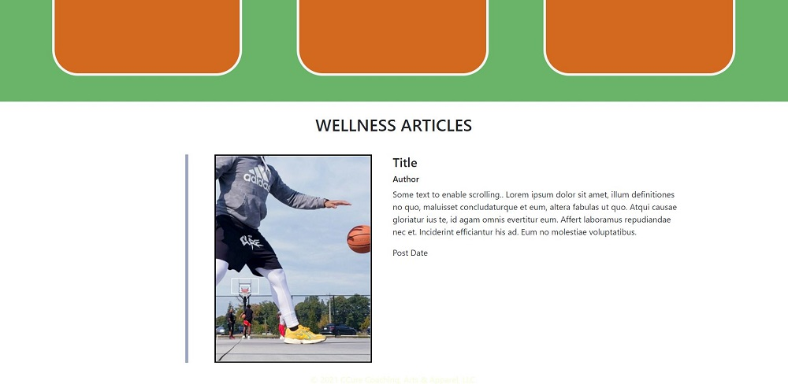

# ccure-site

   

## Description
Designed a professional website for my fine art, fashion pieces and mental health blog.

## Table Of Contents
* [Links](#links)

* [Screenshots](#screenshots)

## Links
[Git Repo](https://github.com/asantercureton/ccure-site)

## Screenshots
Below is a screenshot of the project:

---
© 2021 CCure Coaching, Arts & Apparel, LLC.